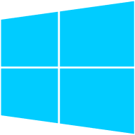
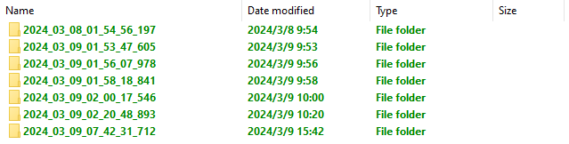
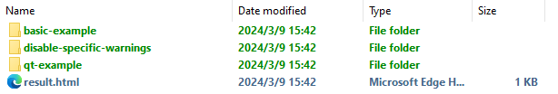
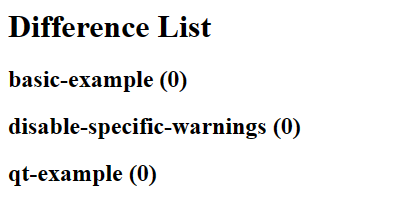

<div align="center">

</div>

## Feature

- Generate CMake files with configuration in json format.
- Create C++ solution with 1 click.
- Written in TypeScript with predictable static types.

## Environment Support

Supported operating systems and integrated development environments are listed.

||<br/>Visual Studio|<br/>CodeBlocks|
|:-:|:-:|:-:|
|<br/><b>Windows</b>|✅||
|<br/><b>MacOS</b>|||
|<br/><b>Linux</b>|||

## Install

- Install [Node.js](https://nodejs.org/en).
- Download the lastest release of CMakeMake.
- Unzip the release and copy files to your project.
- Install dependencies via npm.

```shell
npm install
```

## Usage

- Configure your project in json format.
- Generate CMake files using CMakeMake.
- Create solution using CMake.

## Development

- Install [Node.js](https://nodejs.org/en).
- Clone this repository using git.
- Install dependencies via npm.

```shell
git clone git@github.com:zhuuuoyue/CMakeMake.git
cd CMakeMake/cmm
npm install
```

## Debug

- Select 'Open with Code' on context menu in `cmm` directory.
- Creat configuration file `launch.json` in `.vscode` directory.
- Edit `program` field.
- Add `args` field to specify command line arguments.
- Press F5 to start debugging.

```json
{
    "version": "0.2.0",
    "configurations": [
        {
            "type": "node",
            "request": "launch",
            "name": "Launch Program",
            "skipFiles": [
                "<node_internals>/**"
            ],
            "program": "${workspaceFolder}\\build\\main.js",
            "args": ["--solution_dir", "path-to-solution-directory"]
        }
    ]
}
```

## Test

Double click batch file `run_test.bat` to start testing. The test result will be in folder `test-output`. All test results in folder `test-output` are named using date and time.



All testcase results are list in your test running folder as below.



The HTML file `result.html` gives the difference list.



## Create Archive

Double click batch file `create_archive.bat` and create archive automatically. The created archive (*.zip) will be in folder `archives`.
