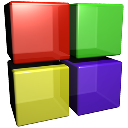

<div align="center">

</div>

## Feature

- Generate CMake files with configuration in json format.
- Create C++ solution with 1 click.
- Written in TypeScript with predictable static types.

## Environment Support

Supported operating systems and integrated development environments are listed.

||<br/>Visual Studio|<br/>CodeBlocks|
|:-:|:-:|:-:|
|<br/><b>Windows</b>|✅||
|<br/><b>MacOS</b>|||
|<br/><b>Linux</b>|||

## Install

- Install [Node.js](https://nodejs.org/en).
- Download the lastest release of CMakeMake.
- Unzip the release and copy files to your project.
- Install dependencies via npm.

```shell
npm install
```

## Usage

- Configure your project in json format.
- Generate CMake files using CMakeMake.
- Create solution using CMake.

## Development

- Install [Node.js](https://nodejs.org/en).
- Clone this repository using git.
- Install dependencies via npm.

```shell
git clone git@github.com:zhuuuoyue/CMakeMake.git
cd CMakeMake/cmm
npm install
```
